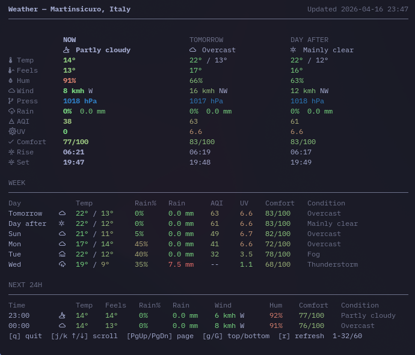
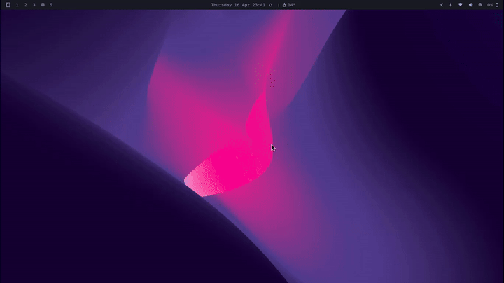

# waybar-weather-tui

Small Python weather script for my Waybar on Hyprland / Omarchy.

It does two things:

- normal mode prints JSON for a `custom/weather` Waybar module
- `--tui` opens a terminal weather dashboard that I use as a floating popup

This is a useful personal setup, not a polished app. It was heavily vibe-coded, but it works well enough to share.



## What it does

- current weather in Waybar
- tooltip with forecast + alerts
- TUI popup with a bigger hourly/daily view
- simple refresh and location helpers



## Repo files

- [scripts/weather.py](scripts/weather.py) is the script
- [examples/waybar/config.jsonc](examples/waybar/config.jsonc) is an example Waybar config
- [examples/hypr/weather.conf](examples/hypr/weather.conf) is an example Hyprland config

## Waybar setup

Copy `scripts/weather.py` into your Waybar scripts folder, then adapt the `custom/weather` block from [examples/waybar/config.jsonc](examples/waybar/config.jsonc).

The module in this repo uses:

```jsonc
"custom/weather": {
  "exec": "~/.config/waybar/scripts/weather.py --ttl 300 --icons nerd",
  "return-type": "json",
  "interval": 300,
  "tooltip": true,
  "on-click": "exec setsid uwsm-app -- xdg-terminal-exec --app-id=custom.weather.tui --title=Weather-TUI -e bash -c \"bash -lc '~/.config/waybar/scripts/weather.py --tui --hold --colored --units metric --h-format 24h --ttl 300 --livecheck-ttl 300 --width 95 --days 6 --hours 24'\"",
  "on-click-middle": "~/.config/waybar/scripts/weather.py --refresh"
}
```

## Hyprland setup

The TUI popup can be controlled with Hyprland window rules. I saved my example in [examples/hypr/weather.conf](examples/hypr/weather.conf).

```hyprlang
# Floating windows weather-tui
windowrule = float on, match:tag floating-weather-tui
windowrule = center on, match:tag floating-weather-tui
windowrule = size 695 600, match:tag floating-weather-tui

windowrule = tag +floating-weather-tui, match:class custom.weather.tui
windowrule = tag +floating-weather-tui, match:class custom.weather.tui
```

You can save that in:

```text
~/.config/hypr/weather.conf
```

And source it from:

```text
~/.config/hypr/hyprland.conf
```

with:

```hyprlang
source = ~/.config/hypr/weather.conf
```

Add that at the end of your Hyprland configuration file.

## Notes

- written for my Hyprland / Omarchy desktop
- tested as a custom Waybar module, not as a generic package
- if you want a cleaner production-ready project, this is not that
